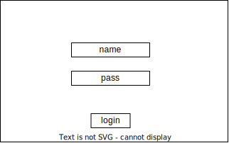

# RideMate基本設計書

## 1. システム概要
RideMateは、ユーザ間で技術情報を共有するためのWebアプリケーションです。  
ユーザはアカウントを作成し、記事を投稿し、コメントや「いいね」を行うことができます。

## 2. システム構成図

## 3. 機能一覧
### 3.1 ユーザ管理
- アカウント作成
- ログイン
- ログアウト
- セッション管理と認証（クッキー利用）

### 3.2 組織管理
- 組織作成
- 組織への参加

### 3.3 チャンネル管理
- チャンネル作成
- チャンネル「all」の存在

### 3.4 タグ管理
- タグ作成
- 全ユーザへの共有

### 3.5 投稿管理
- マークダウン形式のエディタによる記事投稿
- 投稿先チャンネル指定
- タグ付け
- チャンネルやタグを用いた絞り込み閲覧

### 3.6 インタラクション
- 記事へのコメント
- メンション機能による通知
- 記事への「いいね」

## 4. 画面設計図
### 4.1 ログイン画面

### 4.2 ホーム画面

### 4.3 記事投稿画面

### 4.4 記事閲覧画面

### 4.5 プロフィール画面

## 5. 環境
- 使用技術: Docker, HTML/CSS/JavaScript, バックエンド言語（例: Python, Node.js）
- データベース: 適切なデータベース（例: PostgreSQL, MySQL）
- セキュリティ: パスワードハッシュ化、HTTPS通信
- レスポンシブデザイン: モバイル対応UI
