# 技術情報共有ツール詳細設計書

## 1. システム全体のアクティビティ図

## 2. 各機能詳細
- [ユーザ管理機能](./ユーザ管理/ユーザ管理.md)
- [組織管理機能](./組織管理/組織管理.md)
- [チャンネル管理機能](./チャンネル管理/チャンネル管理.md)
- [タグ管理機能](./タグ管理/タグ管理.md)
- [投稿管理機能](./投稿管理/投稿管理.md)
- [インタラクション機能](./インタラクション/インタラクション.md)
